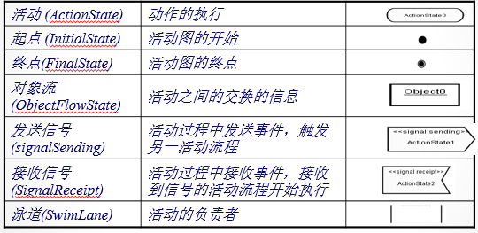

# 系统分析与设计

## 第一章 软件过程

### SWOT分析法

* SWOT分析法是用来确定企业自身的竞争优势、竞争劣势、机会和威胁，从而将公司的战略与公司内部资源、外部环境有机地结合起来的一种科学的分析方法。

* strengths 优势
* weaknesses 劣势
* opportunities 机会
* threats 威胁

### 三级管理系统

* 策略级 - 知识处理系统
* 战术级 - 分析处理系统
* 操作级 - 事务处理系统

### OLTP 联机事务处理系统

* OnLine Transaction Processing

* 典型如银行的存取系统

### OLAP 联机分析处理

* 对历史数据进行分析处理，用以辅助决策

### 软件开发模型

* 螺旋模型
* 敏捷开发

## 第二章 需求确定

### BPMN 业务流程建模与标注

* 泳道 - 参与者
* 流对象
* 人工制品
* 连接对象

### 需求引导

#### 需求？

* 定义了系统的期望服务和系统必须遵守的约束

#### 功能性需求 - 期望服务

* 系统范围
* 必须的业务功能
* 要求的数据结构

#### 非功能性需求 - 约束

* 可用性– 易用性
* 可复用性– 易于构件复用
* 可靠性
* 性能
* 效率
* 可支持性

### 需求引导的方法？

1. 面谈
1. 调查表
1. 观察与研究业务文档

### 需求引导的现代方法 - 用于高风险项目

1. 原型
1. 头脑风暴
1. ......

### 需求管理

* 需求跟踪

## 第三章 可视化建模基础

### 用例视图

* 用例 Case，**外部可见**的系统功能单元
* 参与者 User，与用例交互的外部用户

#### 注意

* 参与者**不是实例**
* 一个功能性需求可以直接映射为一个用例

#### 用例图图示

* 关联，实线，表示参与者与用例的交互
* 包含，include，虚线实箭头，箭头指向的用例为被包含的用例，被包含用例是必选的
* 扩展，extend，虚线实箭头，箭头指向的用例为被扩展的用例，被扩展用例可以缺失
* 泛化，实线空箭头，发出箭头的事物“is a”箭头指向的事物。

### 活动视图

* 活动图类似于传统意义上的流程图，描述一项业务功能（如一个用例）的内部执行过程

#### 活动图图示

### 结构视图

* 数据结构
* 数据关系
* 操作

### 交互视图

#### 顺序图

* 每条垂直线称为对象的生命线，表示对象存在的时间。
* 在生命线上激活的方法叫激活（控制焦点），作为垂直的矩形显示在顺序图上，表示此时间段内对象执行相应操作。

### 状态机视图

* 描述对象的生命周期

## 第四章 需求规格说明

### MVC

* 分离视图，模型和控制器，解耦，增加重用性和可靠性

## 第六章 系统体系设计

### 内聚与耦合

* 类内聚：一个类内部自确定的程序，测量类的独立性
* 类耦合：类之间连接的程度，测量类的相互依赖性

